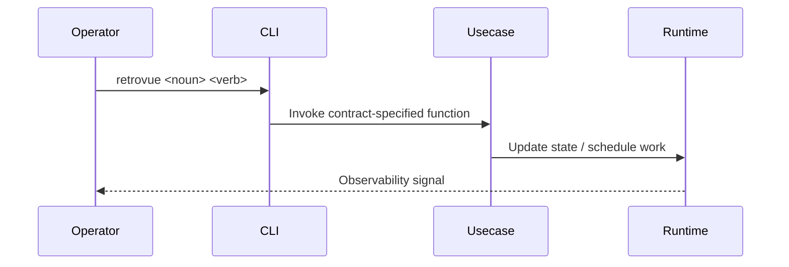

# <System or capability name> architecture

_Related: [Higher-level overview](../architecture/ArchitectureOverview.md) • [Key domain concept](../domain/SomeConcept.md)_

## Purpose

State the design problem this system solves and why the architecture exists. Keep it focused on operator or runtime outcomes.

## Context

- Summarize where this component sits within the Retrovue layers (domain, runtime, CLI, infra).
- Include upstream and downstream dependencies.
- Note production vs. test environment differences if any.

## Design drivers

- List the top constraints or goals (throughput, determinism, fail-safe behavior).
- Call out regulatory or content obligations that shaped the design.

## Responsibilities

| Responsibility | Details | Contracts/tests |
| --- | --- | --- |
| Example | Short description | `docs/contracts/...` |

- Expand in prose when a responsibility needs nuance.

## Data and interfaces

### Inputs

- Enumerate inputs (events, database tables, CLI calls) and their formats.
- Link to schema docs or contract files.

### Outputs

- Describe outputs (playout plans, state transitions, metrics).
- Clarify delivery mechanisms (db writes, queues, API responses).

## Operational flow

- Provide a Mermaid diagram (sequence, flowchart, or state diagram) illustrating the happy path.
- Describe the narrative that matches the diagram in text.

## Failure and fallback behavior

- List failure modes, detection method, and fallback strategy.
- Identify what the CLI/user sees and what gets logged.
- Note rollback or retry expectations.

## Deployment and scaling

- Document runtime footprint (processes, containers, workers).
- Mention horizontal/vertical scaling strategy and any known limits.
- Include operational runbooks when available.

## Security and compliance

- Call out data classification, access constraints, token handling, audit requirements.
- Reference secrets management practices if applicable.

## Testing strategy

- Map architecture elements to contract tests and integration suites.
- Outline manual validation steps for major changes.

## Open questions

- Track unresolved decisions, experiments, or research tasks.
- Link to GitHub issues or RFCs.

## See also

- [Related architecture doc](../architecture/<other>.md) — Short description
- [Contract doc](../contracts/resources/<contract>.md) — Guarantees the implementation must satisfy

